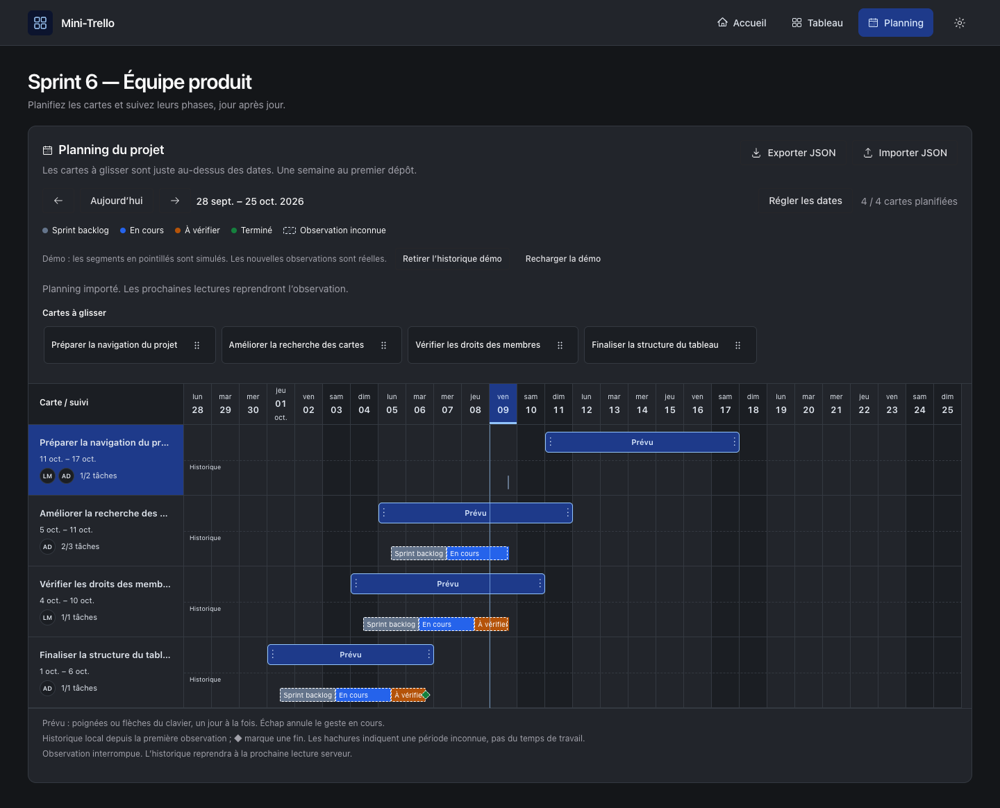

<div align="center">

# Mini-Trello

**Organiser les cartes. Planifier le projet. Suivre les phases.**

Une application de gestion de projet agile avec Kanban, membres, checklists,
commentaires et calendrier Gantt.

React 19 · TypeScript · Chakra UI · TanStack Query · React DnD · Motion

[Installation](#installation) · [Tableau](#tableau-kanban) · [Planning](#planning-du-projet--sprint-6) · [Démo](#préparer-la-démo) · [Tests](#vérification)

</div>



*Aperçu du Gantt avec des cartes de test et un historique de démonstration explicitement identifié.*

## Ce que permet le projet

| Espace | Fonctionnalités |
| --- | --- |
| **Tableau** | Créer et modifier des cartes, les déplacer entre colonnes et les réordonner. |
| **Carte** | Assigner des membres, échanger des commentaires et suivre une checklist. |
| **Planning** | Poser les cartes sur un calendrier, déplacer leurs périodes et ajuster leurs dates. |
| **Historique** | Visualiser les statuts observés, leurs transitions et les interruptions d’observation. |
| **Interface** | Thèmes clair et sombre, navigation au clavier et réduction des animations. |

## Installation

### Prérequis

- **Node.js ≥ 22.22.0** et npm.
- L’**API fonctionnelle fournie pour le projet**, lancée séparément. Elle doit prendre en charge les lectures et les écritures ; le starter limité à GET ne suffit pas.
- Par défaut : API sur `http://localhost:3000`, frontend sur `http://localhost:5173`. Autoriser cette origine frontend dans la configuration CORS de l’API.

### Lancer le frontend

Depuis ce dépôt :

```bash
npm ci
npm run dev -- --host localhost
```

Ouvrir [localhost:5173](http://localhost:5173).

| Page | Adresse |
| --- | --- |
| Accueil | [localhost:5173](http://localhost:5173) |
| Tableau Kanban | [localhost:5173/board](http://localhost:5173/board) |
| Planning Gantt | [localhost:5173/planning](http://localhost:5173/planning) |

Pour utiliser une autre adresse d’API, créer un fichier **`.env.local`**, sans le committer :

```dotenv
VITE_API_URL=http://localhost:3000
```

Redémarrer Vite après un changement de configuration. Les cartes sont chargées depuis l’API : `data/board.json` reste un jeu de données de référence, sans remplacement automatique en cas d’échec réseau.

<details>
<summary><strong>Lancer l’API avec PostgreSQL ou SQLite</strong></summary>

Exécuter ces commandes **dans le dépôt de l’API**, avec Node.js 22+ :

```bash
cp .env.example .env
npm ci
docker compose -f docker-compose.yml -f docker-compose.j2.yml up -d db pgweb
docker compose -f docker-compose.yml -f docker-compose.j2.yml ps
# Attendre que db soit healthy.
npm run db:migrate
npm run dev
```

Pour SQLite, définir `DB_DRIVER=sqlite` dans l’environnement de l’API, puis lancer `npm run db:migrate` et `npm run dev` sans Docker. Consulter le README de l’API pour les opérations de réinitialisation et l’accès à pgweb.

</details>

## Tableau Kanban

Les cartes parcourent les colonnes du tableau, du backlog à la fin du travail.

- **Créer** une carte depuis le formulaire d’une colonne, même vide.
- **Sélectionner** une carte en cliquant dessus, ou avec Entrée/Espace lorsqu’elle a le focus.
- **Déplacer** sa poignée pour choisir une colonne et une position. Les colonnes vides acceptent les dépôts.
- **Modifier** via le crayon : titre, description, membres, commentaires et checklist.

| Commande | Action sur la carte sélectionnée |
| --- | --- |
| `←` / `→` ou boutons gauche/droite | Déplacer vers la colonne voisine. |
| `↑` / `↓` | Réordonner dans la colonne. |
| `Échap` | Désélectionner. |

Les raccourcis respectent les champs de saisie et le tiroir d’édition. Un dépôt hors des colonnes ou sans changement de position n’envoie aucune requête.

### Membres, commentaires et checklist

Les initiales des membres apparaissent sur les cartes ; leurs noms sont accessibles au survol et aux technologies d’assistance. Les références inconnues restent conservées et identifiées.

Les tâches inachevées sont cochables directement dans le Kanban. Une tâche terminée disparaît de cet aperçu et reste cochée dans le tiroir, où elle peut être réouverte. Les membres et les tâches se sauvegardent immédiatement.

Pour publier un commentaire, sélectionner d’abord son auteur. Les commentaires existants conservent leur ordre et leur date serveur. Fermer le tiroir abandonne les textes non soumis ; enregistrer le titre et la description ferme le tiroir après confirmation.

### Sauvegarde et erreurs

Les déplacements apparaissent immédiatement puis sont confirmés par une nouvelle lecture serveur. Un échec annule la modification optimiste et affiche une erreur. Les écritures locales sont sérialisées et attendent la réconciliation avant d’autoriser la suivante.

Pour les collections, le frontend relit la carte avant la modification et préserve les données existantes, y compris les descriptions de tâches identiques. Une réponse incertaine ou une réconciliation échouée propose **Actualiser** sans republier automatiquement la même opération.

## Planning du projet — Sprint 6

Le planning possède sa **page dédiée**. Une liste compacte de titres se trouve immédiatement au-dessus des dates : il est possible de glisser une carte sans traverser tout le Kanban ni faire défiler la page pendant le geste.

### Planifier sans ouvrir une carte

1. Glisser la poignée d’un titre sur un jour : le premier dépôt crée **sept jours calendaires**, week-end compris.
2. Déplacer la barre **Prévu** pour conserver sa durée tout en changeant ses dates.
3. Tirer l’une de ses deux poignées pour ajuster le début ou la fin, avec un minimum d’un jour.

Un nouveau dépôt de la même carte déplace sa période existante en conservant la durée. **Retirer du planning** supprime uniquement les dates, en gardant la carte et son historique.

L’alternative **Régler les dates** permet de choisir une carte et de saisir ses dates. Les flèches gauche/droite déplacent aussi la barre ou une poignée d’un jour ; **Échap** annule le geste en cours.

### Lire le calendrier

Le Gantt affiche quatre semaines, avec navigation par semaine et retour à **Aujourd’hui**. La fenêtre initiale commence la semaine précédente pour rendre les phases récentes visibles. Les titres et les dates restent fixes pendant le défilement ; les week-ends et le jour courant sont distingués.

Chaque ligne affiche le titre, les membres et la progression de checklist lorsqu’elle contient des tâches, puis deux pistes indépendantes :

| Piste | Signification |
| --- | --- |
| **Prévu** | Dates choisies, déplaçables et redimensionnables. |
| **Historique** | Statuts confirmés après lecture serveur, colorés par colonne. |
| **Hachures** | Intervalle inconnu après une interruption d’observation. |
| **◆** | Passage constaté dans `done` ; la barre reprend en cas de réouverture. |
| **Pointillés sur un segment** | Historique simulé de démonstration. |

Le survol et le focus donnent les dates et les statuts. Les mises à jour optimistes, leurs annulations et les réordonnancements dans une même colonne ne créent pas de transition historique.

**L’historique est local et partiel : il décrit les statuts observés, pas le temps de travail.** Il commence à la première lecture confirmée et ne reconstitue pas les phases réelles précédentes. Une carte déjà terminée lors de cette lecture n’a pas de date de fin réelle inventée.

### Où sont sauvegardées les données ?

```text
API existante                  Navigateur · localStorage
├── cartes et colonnes         ├── périodes prévues
├── titres et descriptions     ├── observations de statut
├── membres                    └── historique simulé identifié
├── commentaires                         ↕
└── checklists                     Export / import JSON v1
```

Les données du calendrier sont enregistrées automatiquement sous `mini-trello:calendar:v1:mini-trello`. **Planifier n’écrit jamais dans l’API** ; Sprint 6 ne modifie ni le backend ni `src/api/`.

**Exporter JSON** transfère les périodes et l’historique. **Importer JSON** vérifie la version, le tableau, les identifiants et les dates, puis demande confirmation avant remplacement. Un fichier invalide ou un stockage inaccessible conserve la dernière sauvegarde. Une modification détectée dans un autre onglet bloque l’écrasement et demande un rechargement.

## Préparer la démo

Au premier chargement réussi du tableau dans un navigateur sans planning enregistré, le calendrier préremplit les **cartes déjà présentes dans l’API**. Il ne crée pas de cartes serveur.

| Statut actuel | Exemple généré |
| --- | --- |
| Backlog | Période future, sans fausse phase de vérification. |
| En cours | Début récent, phases backlog puis travail en cours. |
| À vérifier | Phases backlog, travail puis vérification. |
| Terminé | Période passée et un seul repère de fin. |

Les phases simulées sont signalées en pointillés et nommées dans leurs détails. Les nouvelles observations de statut restent réelles.

- **Recharger la démo** actualise les exemples après confirmation du remplacement du planning et de l’historique locaux. Pour garder ses propres dates, exporter d’abord le JSON.
- **Retirer l’historique démo** enlève seulement les phases simulées, en conservant les dates et les observations réelles.
- Un rechargement de page ne recrée pas automatiquement une démo déjà supprimée.

## Vérification

```bash
npm test
npm run lint
npm run build
```

La validation de Sprint 6 comprend **30 tests réussis**, le lint et le build. Les tests couvrent les dates calendaires et changements d’heure, les transitions confirmées, les échecs, les interruptions, le JSON, le stockage et la cohérence de la démo.

Les tests navigateur utilisent **localhost**, un profil isolé et des réponses API simulées pour éviter toute écriture sur le serveur réel. Ils vérifient le drag natif, les poignées, le clavier, l’import/export, le rollback du Kanban, ainsi que les thèmes clair/sombre sur ordinateur et affichage étroit.

Comptes rendus : [Sprint 6 — Gantt](.scratch/sprint6-gantt/validation.md) · [Collections des cartes](.scratch/card-collections/validation.md).

<details>
<summary><strong>Simuler un échec d’écriture sans modifier le serveur</strong></summary>

Avec le tableau chargé, exécuter ce code dans la console du navigateur. Il bloque **la prochaine écriture** avant qu’elle atteigne le serveur ; l’erreur et le rollback peuvent alors être vérifiés. Recharger la page restaure également le comportement normal de `fetch`.

```js
const originalFetch = window.fetch
window.fetch = (...args) => {
  if (['POST', 'PATCH', 'PUT'].includes(args[1]?.method)) {
    window.fetch = originalFetch
    return new Promise((_, reject) => {
      setTimeout(() => reject(new Error('Échec simulé')), 600)
    })
  }
  return originalFetch(...args)
}
```

</details>

## Repères dans le code

| Dossier | Rôle |
| --- | --- |
| `src/pages/` | Accueil, tableau, planning et page introuvable. |
| `src/components/` | Interface Chakra, cartes, tiroir, Gantt et animations. |
| `src/api/` | Lectures, mutations, validation des collections et déplacements. |
| `src/calendar/` | Dates, historique observé, JSON et persistance locale. |
| `src/types/` | Types des cartes, colonnes, membres et collections. |
| `tests/` | Tests du modèle et des opérations de données. |
| `.scratch/` | Spécifications et comptes rendus de validation. |

### Contrats API utilisés

| Méthode | Route | Usage |
| --- | --- | --- |
| `GET` | `/boards/mini-trello` | Lire le tableau. |
| `GET` | `/users` | Charger le catalogue des membres. |
| `POST` | `/columns/:columnId/cards` | Créer une carte. |
| `PATCH` | `/cards/:cardId` | Modifier le texte ou une collection de carte. |
| `PUT` | `/cards/:cardId` | Déplacer une carte. |

Une position de déplacement est calculée **après le retrait de la carte** ; son omission ajoute la carte à la fin de la colonne. Une collection fournie dans un PATCH remplace cette collection entièrement ; celles omises sont conservées.

## Limites de cette version

- Pas d’authentification ; le choix d’un auteur de commentaire ne constitue pas une connexion.
- Planning propre au navigateur, sans synchronisation entre utilisateurs. Exporter avant de vider le stockage local.
- Sous-tâches non planifiables individuellement ; pas de drag multi-cartes. Sur écran tactile, utiliser le réglage des dates comme alternative au drag HTML5.
- Les écritures concurrentes de plusieurs navigateurs sur une même collection nécessiteraient un contrôle de version côté serveur pour éviter tout remplacement concurrent.
- Le trackpad physique du MacBook n’a pas été testé. Les mutations navigateur ont été vérifiées avec une API simulée ; le build signale un bundle JavaScript supérieur à 500 Ko.
